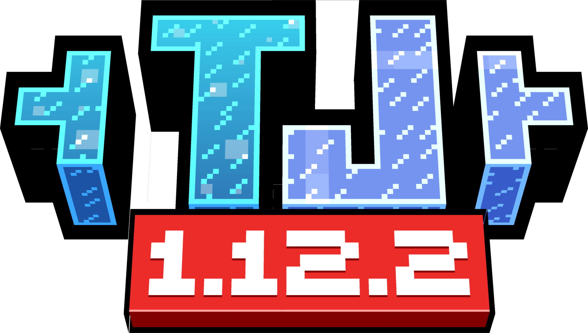

  
  <h1>Technological Journey</h1>
  <h5>Minecraft tech modpack based around <a href="https://gregtech.overminddl1.com/">Gregtech<a> and its multiple counterparts</h5>
  <h1 align="center">
    
    
    <a href="https://github.com/Technological-Journey/Technological-journey/">
    
    
    <a href="https://github.com/Technological-Journey/Technological-journey/">
    
    </a>
    
    
  </h1>

Welcome to **Technological Journey**, a Minecraft modpack designed for players who want a deep, intricate, and rewarding experience with automation, technology, and progression. Featuring a modified version of **GregTechCE** and **Gregicality**, alongside other powerful mods like **EnderIO**, **Advanced Rocketry**, and **AE2**, this modpack takes the classic GregTech experience to the next level. Whether you’re new to modded Minecraft or a seasoned player, this pack offers the ultimate technical challenge while minimizing grind.
## Overview

- **Focus**: Advanced automation, complexity, and crafting
- **Core Mods**: GregTechCE, Gregicality, Draconic Additions, EnderIO, AE2, Advanced Rocketry
- **Key Features**: Craftable Supra-Causal Circuits, craftable UIV/UP machines, advanced multiblocks, polymers, and new chemistry systems
- **Endgame**: Draconic Additions as the ultimate tech challenge

---

## Key Features

- [Modified GregTechCE and Gregicality Integration](#modified-gregtechce-and-gregicality-integration)
- [Craftable Supra-Causal Circuits](#craftable-supra-causal-circuits)
- [Advanced Machines and Multiblocks](#advanced-machines-and-multiblocks)
- [Polymers, Chemistry, and New Circuit Types](#polymers-chemistry-and-new-circuit-types)
- [EnderIO and AE2 Integration](#enderio-and-ae2-integration)

---

## Gameplay and Progression

- [Early Game: Steam Age](#early-game-steam-age)
- [Mid-Game: Advanced Automation](#mid-game-advanced-automation)
- [Endgame: Draconic Additions](#endgame-draconic-additions)

---

### Modified GregTechCE and Gregicality Integration

**GregTechCE** provides the backbone for the technical progression in **Technological Journey**, with a heavily customized setup to reduce grind while maintaining its complexity. The addition of **Gregicality** enhances this experience by introducing deeper layers to the tech tree and offering more interconnected progression steps. This integration ensures that you’re always working towards something meaningful, and each machine you craft feels like a major accomplishment.

### Craftable Supra-Causal Circuits

One of the most exciting features of **Technological Journey** is the introduction of **craftable GCYL Supra-Causal Circuits**—exclusive to this modpack. These circuits are key to unlocking the most powerful machines and systems in the game, requiring players to engage deeply with GregTech's advanced mechanics and automation systems. Along with these, the pack introduces other advanced circuit types that will challenge you to master new crafting strategies.

### Advanced Machines and Multiblocks

The modpack expands on GregTech’s traditional machines and multiblocks by introducing entirely new types. This includes **UIV and UP machines** and several additional high-tier multiblocks that bring fresh complexity to the game's crafting systems. These new machines are crafted using advanced circuits and materials and play a critical role in advancing through the technology tree.

### Polymers, Chemistry, and New Circuit Types

To further enhance progression, **Technological Journey** introduces new crafting systems involving **Polymers** and **Chemistry**, as well as additional **circuit types**. Polymers become essential in crafting powerful components and building advanced machinery, while chemistry lines offer deeper resource processing and material manipulation, unlocking a wide array of new crafting possibilities.

### EnderIO and AE2 Integration

To complement the complexity of GregTech, **EnderIO** and **Applied Energistics 2 (AE2)** are integrated to streamline automation and resource management. **AE2**’s **ME networks** allow for sophisticated item storage and retrieval, while **EnderIO** introduces powerful automation systems, energy solutions, and conduits to connect all your machines seamlessly. These mods ensure that your journey through the tech tree is supported by efficient, scalable solutions for automation and resource management.

---

### Early Game: Steam Age

**Technological Journey** starts with a **Steam Age** where you’ll craft basic steam-powered machines and begin automating simple tasks. While the early game is intentionally slow-paced, it serves as a foundation for the advanced technology you’ll unlock as you progress. You'll gradually move from primitive steam engines to more complex machines, setting the stage for the deeper mechanics that follow.

### Mid-Game: Advanced Automation

As you advance through the **Steam Age**, you’ll begin to craft more powerful machines and integrate more complex systems. By the time you reach the **Mid-Game**, you'll be automating large portions of your base, using tools like **EnderIO** and **AE2** to streamline your production and resource management. The introduction of advanced circuits and chemistry systems opens up new pathways for automation and complex crafting.

### Endgame: Draconic Additions

The endgame of **Technological Journey** is centered around **Draconic Additions**, a powerful mod that offers some of the most advanced machines, tools, and energy systems in the game. Reaching this stage is no small feat, as it requires mastering the full suite of GregTech, automation, and resource management systems. The **Draconic Additions** mod provides a fitting challenge for seasoned players, offering game-changing technology that pushes your capabilities to the limit.
